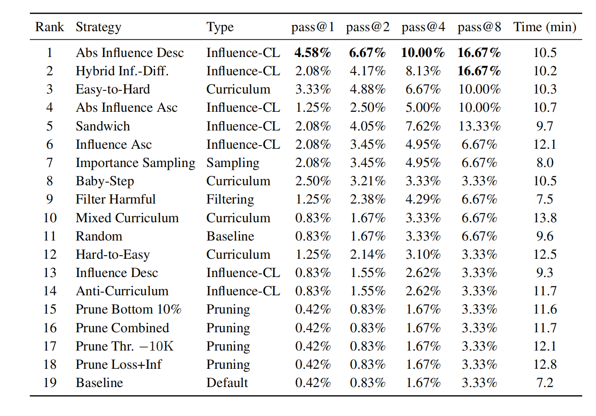
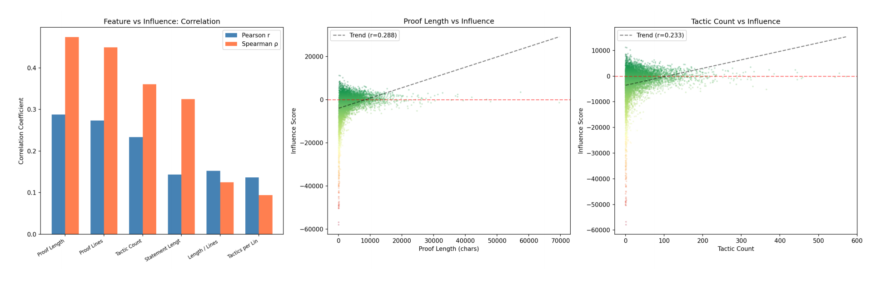

# 🚀 Influence-Guided Curriculum Learning for Lean4 Theorem Proving

## 📌 Overview

We present a **data-centric approach to automated theorem proving in Lean 4**, leveraging **influence functions** to quantify the contribution of individual training samples and guide data selection.

Our framework fine-tunes **Qwen2.5-0.5B-Instruct (QLoRA)** on **8,497 theorem–proof pairs** from the NuminaMath-LEAN dataset, and computes per-sample influence scores using the **DataInf approximation**. Based on these signals, we systematically explore how **data ordering and selection strategies** impact reasoning performance.

---

## 🔥 Key Results

- 🥇 **Best Strategy: Abs Influence Desc (Ours)**
  - pass@1: **4.58%**
  - pass@8: **16.67%**
  - 🚀 **~5× improvement over baseline (3.33%)**

- 📈 **Curriculum Learning Works**
  - Easy → Hard outperforms random:
    - ~4× improvement in pass@1  
    - ~1.5× improvement in pass@8  

- ❌ **Data Pruning Fails**
  - All pruning strategies underperform or match baseline  
  - 👉 **Data diversity > data purity**

---

## 📊 Strategy Comparison

> Comparison of 19 data strategies on MiniF2F benchmark

---

## 📉 Influence Analysis

- Influence strongly correlates with proof length (**Spearman ω = 0.474**)  
- High-value samples are ~**7× longer** than low-value samples  
- 👉 Influence ≈ **information content**

---

## 🧠 Key Insights

- Not all data contributes equally — **influence provides a practical data valuation signal**
- **Data ordering is more important than data filtering**
- Longer and more complex proofs carry richer learning signals

---

## 🧪 Experimental Setup

- **Model:** Qwen2.5-0.5B-Instruct (QLoRA)
- **Dataset:** NuminaMath-LEAN (8,497 samples)
- **Benchmark:** MiniF2F
- **Method:** DataInf influence approximation

---

## 🏗️ Project Structure
lean4-influence-curriculum/
├── README.md                         # Project overview
├── final_report/                     # Analysis and experimental results
│   ├── reports/                      # Detailed analysis reports
│   ├── tables/                       # Data tables
│   └── logs/                         # Execution logs
├── assets/                           # Figures for README 
│   ├── strategy_comparison.png       # Strategy comparison chart
│   └── influence_length.png          # Influence length analysis
└── scripts/                          # Training & evaluation notebooks
    ├── influence_compute_traditional_curriculum.ipynb   # Traditional curriculum influence computation
    ├── influence_based_training.ipynb                   # Influence‑based training
    └── minif2f_eval_lean4.ipynb                         # MiniF2F evaluation for Lean 4
